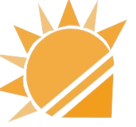
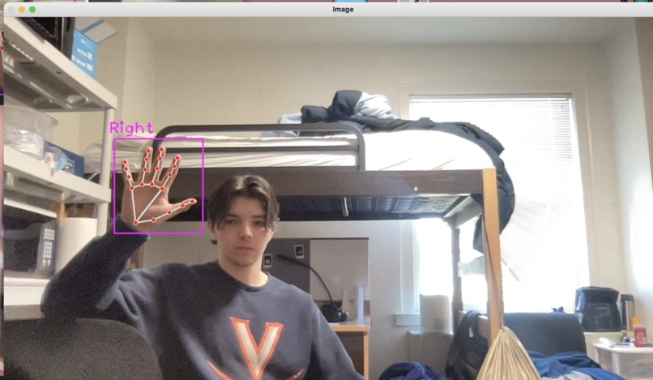
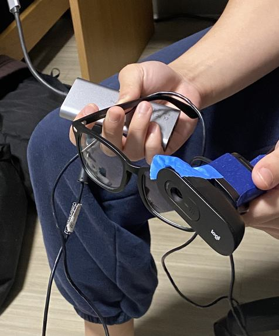

# 🌟 Sunny Glasses  
  
> *Revolutionizing communication for the deaf community.*  

---  

## 📖 Table of Contents  
- [Inspiration](#inspiration)  
- [What It Does](#what-it-does)  
- [How We Built It](#how-we-built-it)  
- [Challenges](#challenges)  
- [Accomplishments](#accomplishments)  
- [What's Next](#whats-next)  

---  

## 💡 Inspiration  
Sunny Glasses is inspired by my deaf grandmother and her service dog, Sunny, to address everyday communication barriers in the deaf community.  

---  

## 🛠️ What It Does  
Sunny Glasses:  
- **Sign Language to Speech:** Converts sign language into spoken English using ML and computer vision.  
- **Speech to Subtitles:** Displays spoken language as subtitles for two-way communication.  

---  

## 🔧 How We Built It  
  
- **ML Model:** Trained a TensorFlow model for sign language recognition.  
- **Speech-to-Text:** Integrated OpenAI's Whisper for real-time translation.  
- **Hardware:** Transitioned from Raspberry Pi to a webcam and PC for improved performance.  

---  

## ⚙️ Challenges  
- Limited computational power of the Raspberry Pi.  
- Building a custom dataset for accurate sign recognition.  

---  

## 🎉 Accomplishments  
  
- Developed a functional ML model with a custom dataset.  
- Enabled real-time translation between sign language and spoken language.  

---  

## 🚀 What's Next  
- Optimize for compactness and efficiency.  
- Develop a market-ready product to support the deaf community.  

